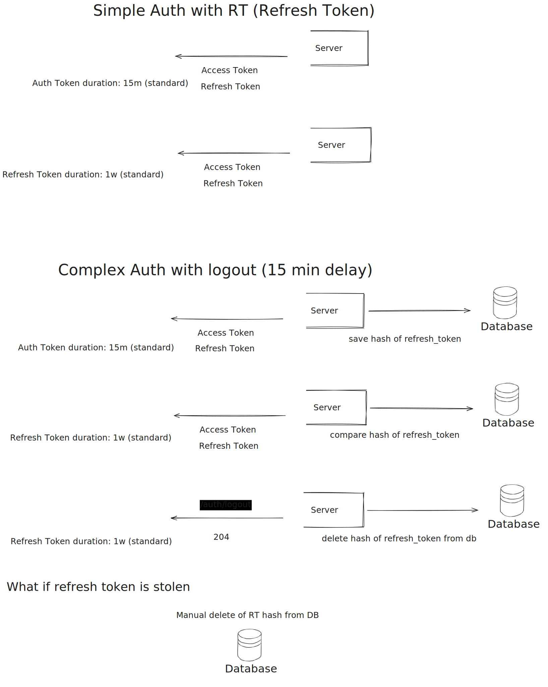

## Installation

```bash
$ yarn install
```

## Running the app

```bash
# start database
$ docker compose up -d

# development
$ yarn run start

# watch mode
$ yarn run start:dev

# production mode
$ yarn run start:prod
```